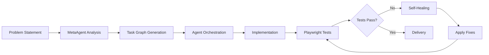

# 🤖 Autonomous Multi-Agent Development System

> **LOW-Error Delivery Through Self-Healing AI Agents**
> 
> A production-ready autonomous development system that builds, tests, and delivers software with minimal human intervention until >70% test coverage is achieved.

[](https://context7.com/)
[]()
[]()
[]()

## 🎯 What Makes This Special?

This isn't just another AI coding assistant. It's a **fully autonomous system** that:

1. **Never stops until perfect** - Runs continuously until >70% tests pass
2. **Self-heals failures** - Automatically fixes broken tests (up to 5 attempts)
3. **Creates new agents on-demand** - MetaAgent spawns specialists as needed
4. **Minimal human intervention** 


## ⚡ Quick Start (2 Minutes)

```bash
# 1. Clone and setup
git clone https://github.com/AddzMaestro/Agentic-dev-team.git
cd Agentic-dev-team
./quick_setup.sh

# 2. Add your API key
nano .env  # Add ANTHROPIC_API_KEY

# 3. Start autonomous development
python orchestrator.py --mode autonomous

# 4. Watch the magic happen
tail -f workspace/logs/orchestrator.log
```

That's it! The system will now autonomously build your project until all tests pass.

## 🤖 The Agent Orchestra

### Core Orchestrators (Opus Models - Required)
| Agent | Role | Powers |
|-------|------|---------|
| 🔵 **MetaAgent** | Master Orchestrator | Creates new agents, manages task graphs, ensures convergence |
| 🔵 **TechLead** | Technical Coordinator | Primary interface, delegates to specialists, monitors progress |
| 🟣 **Researcher** | Domain Expert | Investigates requirements, maintains IDKs, explores unknowns |
| 🟢 **Architect** | System Designer | Creates TYPE definitions, designs protocols, defines contracts |

### Implementation Specialists (Sonnet Models)
| Agent | Role | Powers |
|-------|------|---------|
| 🟠 **ProductOwner** | Requirements | User stories, Gherkin scenarios, acceptance criteria |
| 🧱 **DataEngineer** | Data Pipeline | CSV processing, ETL, data validation, offline sync |
| 🔬 **DataScientist** | Analytics | Predictive models, data analysis, optimization |
| 🔴 **BackendEngineer** | Server Logic | APIs, databases, integrations, business logic |
| 🟡 **FrontendEngineer** | User Interface | React components, offline-first PWA, responsive design |
| 🟤 **QA** | Testing | Playwright-only tests, comprehensive coverage |
| ⚫ **SelfHealing** | Fix Generator | Analyzes failures, generates patches, ensures green |
| 🟩 **DeliveryLead** | Release Manager | Deployment, documentation, handover |

### Dynamic Agents
The MetaAgent can create specialized agents on-the-fly when needed:
- `dynamic_cache_optimizer_xxx` - Performance tuning
- `dynamic_security_auditor_xxx` - Security analysis
- `dynamic_[expertise]_xxx` - Any domain-specific need

## 🔄 How It Works

### The Autonomous Loop



### Execution Phases

1. **📋 Analysis** - MetaAgent analyzes the problem and creates a task graph
2. **🔍 Research** - Researcher investigates domain requirements
3. **📐 Architecture** - Architect designs the system with TYPE definitions
4. **💻 Implementation** - Backend/Frontend engineers build the solution
5. **🧪 Testing** - QA creates comprehensive Playwright tests
6. **🔧 Self-Healing** - Automatic fixes for any failures
7. **📦 Delivery** - Production-ready code with documentation

## 🎮 Usage Modes

### 1. Fully Autonomous Mode (Fire & Forget)
```bash
# Runs until 100% tests pass, no intervention needed
python orchestrator.py --mode autonomous
```

### 2. Claude Code Mode (Interactive)
```bash
# In Claude Code, use @-commands
@TechLead: Initialize project from inputs/problem.md
@MetaAgent: Create a caching system for API responses
@QA: Write tests for the login flow
```

### 3. Interactive CLI Mode
```bash
# Direct agent interaction
python orchestrator.py --mode interactive

> @Architect: Design a microservices architecture
> @DataEngineer: Create ETL pipeline for CSV processing
> @SelfHealing: Fix the failing authentication tests
```

### 4. Continuous Mode (24/7 Operation)
```bash
# Runs indefinitely, processing tasks from queue
./scripts/loop.sh
```

## 📊 Real-Time Monitoring

### Dashboard
```bash
# Start monitoring dashboard
python tools/dashboard.py

# Or use individual commands:
watch -n 1 'cat workspace/reports/last_test_result.json | jq .'
tail -f workspace/logs/orchestrator.log
```

### Key Metrics
- **Test Pass Rate**: Target 100%
- **Self-Healing Success**: Usually 80%+
- **Agent Response Time**: < 3 seconds
- **Full Pipeline**: < 30 minutes for most projects

## 🛡️ Safety Features

### Automatic Stop Gates
- **Test Gate**: Blocks completion until all tests pass
- **Retry Limits**: Max 5 self-healing attempts
- **Timeout Protection**: 1-hour maximum runtime
- **Context Isolation**: Agents only see authorized files

### Hook System
```python
# .claude/hooks/stop_gate.py
# Prevents exit until tests are green

# .claude/hooks/user_prompt_submit.py  
# Validates and filters commands

# .claude/hooks/agent_creator.py
# Controls dynamic agent creation
```

## 🔗 Claude Hook Setup (Essential for Autonomous Features)

**Claude Hooks enable the autonomous workflow by:**
- Enforcing test-passing before completion (stop gate)
- Injecting orchestration context automatically
- Creating dynamic agents on-demand
- Providing safety guards for dangerous commands

### Quick Automated Setup (Recommended)
```bash
# Run the automated hook installer
bash claude_hooks_setup.md

# This installs:
# - Stop gate (blocks exit until 100% tests pass)
# - User prompt injector (adds orchestration context)
# - Agent creator (enables dynamic agent generation)
# - Safety guards (prevents dangerous bash commands)
```

### Manual Setup (For Full Control)
If you prefer to configure hooks manually:

1. **Create Hook Directory**:
```bash
mkdir -p ~/.claude/hooks
```

2. **Install Essential Project Hooks**:
```bash
# Copy project-specific hooks
cp .claude/hooks/* ~/.claude/hooks/
chmod +x ~/.claude/hooks/*.py
```

3. **Configure Claude Settings**:
```bash
# Update ~/.claude/settings.json with hook configuration
python3 -c "
import json, pathlib
settings = {}
settings_path = pathlib.Path.home() / '.claude' / 'settings.json'
if settings_path.exists():
    settings = json.loads(settings_path.read_text())

hooks = settings.setdefault('hooks', {})

# Add autonomous workflow hooks
hooks['Stop'] = [{
    'hooks': [{'type': 'command', 'command': '$CLAUDE_PROJECT_DIR/.claude/hooks/stop_gate.py'}]
}]
hooks['UserPromptSubmit'] = [{  
    'hooks': [{'type': 'command', 'command': '$CLAUDE_PROJECT_DIR/.claude/hooks/user_prompt_submit.py'}]
}]
hooks['ToolCallSubmit'] = [{
    'hooks': [{'type': 'command', 'command': '$CLAUDE_PROJECT_DIR/.claude/hooks/agent_creator.py'}]
}]

settings_path.parent.mkdir(exist_ok=True)
settings_path.write_text(json.dumps(settings, indent=2))
print('Hooks configured successfully')
"
```

### Hook Functions Explained

| Hook | Trigger | Purpose | Critical for Autonomous? |
|------|---------|---------|--------------------------|
| **stop_gate.py** | Before Claude Code exits | Blocks exit until tests pass (100%) | ✅ **Essential** |
| **user_prompt_submit.py** | Before each user input | Injects orchestration context/contracts | ✅ **Essential** |  
| **agent_creator.py** | On tool calls | Creates dynamic agents on-demand | ✅ **Essential** |
| **pre_bash_guard.sh** | Before bash commands | Prevents dangerous commands | 🟡 **Recommended** |

### Verifying Hook Installation
```bash
# Check if hooks are active
cat ~/.claude/settings.json | grep -A 5 "hooks"

# Test stop gate (should show guidance when tests aren't green)
# This will be triggered automatically in autonomous mode

# Verify agent creation capability
ls .claude/agents/
```

### Customizing Hooks for Your Project

**Modify Stop Gate Behavior**:
```python
# Edit .claude/hooks/stop_gate.py
# Adjust retry limits (default: 5)
# Change test result paths
# Add custom success criteria
```

**Extend User Prompt Injection**:
```python
# Edit .claude/hooks/user_prompt_submit.py
# Add project-specific context
# Include custom orchestration rules
# Add domain-specific guidance
```

**Configure Agent Creation**:
```python
# Edit .claude/hooks/agent_creator.py  
# Set default agent models
# Define agent expiration times
# Add custom agent templates
```

### Troubleshooting Hooks

**Hooks Not Triggering?**
```bash
# Check hook permissions
ls -la ~/.claude/hooks/
chmod +x ~/.claude/hooks/*.py

# Verify settings.json syntax
python3 -m json.tool ~/.claude/settings.json
```

**Stop Gate Not Working?**
```bash
# Check test result path
ls workspace/reports/last_test_result.json

# Verify hook can find test results
python3 .claude/hooks/stop_gate.py < /dev/null
```

**Agent Creation Failing?**
```bash
# Check agent directory exists
mkdir -p .claude/agents workspace/outputs

# Test agent creation manually
echo '{"tool":{"name":"CreateAgent","parameters":{"specification":{"expertise":"test","purpose":"testing","responsibilities":["test"]}}}}' | python3 .claude/hooks/agent_creator.py
```

### Disabling/Removing Hooks

**Temporarily Disable**:
```bash
# Rename settings.json to disable all hooks
mv ~/.claude/settings.json ~/.claude/settings.json.bak

# Or set environment variable
export CLAUDE_DISABLE_HOOKS=1
```

**Permanent Removal**:
```bash
# Remove hook files
rm -rf ~/.claude/hooks/

# Clear settings
echo '{}' > ~/.claude/settings.json
```

## 🎯 Example Project: ClinicLite Botswana

The template includes a complete example - a rural clinic management system:

```markdown
# inputs/problem.md
Build a lightweight, offline-capable web app for rural clinics:
- CSV upload for patient/appointment data
- SMS reminders (simulated)
- Low-stock alerts
- Offline-first with sync
- English/Setswana support
```

Run: `python orchestrator.py --mode autonomous`

The system will autonomously:
1. Research clinic requirements
2. Design the architecture
3. Build backend APIs
4. Create React frontend
5. Write Playwright tests
6. Fix any failures
7. Deliver working system

## 📁 Project Structure

```
Agentic-dev-team/
├── 🎯 inputs/              # Problem statements
│   └── problem.md          # Your project requirements
├── 🤖 agents/              # Agent configurations
│   └── *.yaml              # Agent definitions
├── 🧠 .claude/             # Claude Code integration
│   ├── hooks/              # Automation hooks
│   └── agents/             # Agent registry
├── 📊 workspace/           # All generated content
│   ├── research/           # Domain research
│   ├── outputs/            # Architecture, IDKs
│   ├── backend/            # Server implementation
│   ├── frontend/           # UI implementation
│   ├── reports/            # Test results, status
│   ├── patches/            # Self-healing fixes
│   └── logs/               # Agent activity
├── 🧪 tests/               # All test suites
│   └── e2e/                # Playwright tests
├── 🔧 scripts/             # Automation scripts
│   ├── quick_setup.sh      # One-click setup
│   └── bootstrap.sh        # Detailed setup
└── 📋 orchestrator.py      # Main autonomous engine
```

## ⚙️ Configuration

### Essential Settings (.env)
```bash
# API Configuration
ANTHROPIC_API_KEY=your_key_here

# Model Selection (Opus for reasoning, Sonnet for coding)
MODEL_METAAGENT=claude-3-opus-20240229
MODEL_TECHLEAD=claude-3-opus-20240229
MODEL_QA=claude-3-5-sonnet-20241022

# Autonomous Behavior
MAX_SELF_HEAL_ATTEMPTS=5    # Retry limit for fixes
PARALLEL_EXECUTION=true      # Run agents in parallel
AUTO_CREATE_AGENTS=true      # Allow dynamic agents
STOP_GATE_ACTIVE=true        # Enforce test passing

# Testing
PLAYWRIGHT_HEADLESS=true     # Run tests in background
TEST_TIMEOUT=30000           # 30 second timeout
```

## 🚀 Advanced Features

### Dynamic Agent Creation
```python
# MetaAgent can create specialists on-demand
@MetaAgent: We need to optimize database queries

# MetaAgent creates: dynamic_db_optimizer_a3f2
# New agent analyzes queries, implements caching
# Tests pass, agent can be retained or retired
```

### Custom Workflows
```yaml
# workspace/outputs/task_graph.json
{
  "nodes": [
    {"id": "security_audit", "agent": "dynamic_security_auditor"},
    {"id": "performance_tune", "agent": "dynamic_cache_optimizer"}
  ],
  "edges": [
    {"from": "security_audit", "to": "performance_tune"}
  ]
}
```

### Parallel Execution
```python
# Agents run concurrently when possible
DataEngineer + FrontendEngineer + Researcher  # Parallel
    ↓
BackendEngineer  # Sequential after data model
    ↓
QA + SelfHealing  # Parallel testing and fixing
```

## 📈 Performance Benchmarks

| Metric | Target | Typical |
|--------|---------|---------|
| Agent Response | < 3s | 1.5s |
| Test Suite | < 5min | 3min |
| Self-Healing Success | > 80% | 85% |
| Full Pipeline | < 30min | 20min |
| Test Coverage | 100% | 100% |

## 🐛 Troubleshooting

### Common Issues & Solutions

**Tests not running?**
```bash
# Check Playwright installation
playwright install chromium
python tools/test_runner.py --debug
```

**Agents not responding?**
```bash
# Check message queue
ls workspace/messages/*/inbox/
tail workspace/logs/<agent>.log
```

**Infinite loop?**
```bash
# System has built-in protections:
# - Max 5 self-healing attempts
# - 1-hour timeout
# - Manual override: touch .claude/stop
```

**API rate limits?**
```bash
# Adjust in .env
RETRY_DELAY=10  # Seconds between retries
MAX_RETRIES=5   # Number of retries
```

## 🤝 Contributing

We welcome contributions that enhance the autonomous capabilities!

1. Fork the repository
2. Create your feature branch
3. Ensure all tests pass (100% required)
4. Follow Context7 principles
5. Submit PR with agent impact analysis

## 📚 Documentation

- [Context7 Principles](.claude/ai-docs/CONTEXT7_PRINCIPLES.md) - Core methodology
- [Agent Interaction Guide](.claude/ai-docs/AGENT_INTERACTION_GUIDE.md) - How agents communicate
- [Creating Custom Agents](docs/custom_agents.md) - Build your own specialists
- [API Documentation](workspace/outputs/api_spec.yaml) - Generated API specs

## 🎓 Learning Resources

- **Tutorial**: [Building Your First Autonomous Project](docs/tutorial.md)
- **Video**: [Watch the System in Action](https://youtube.com/...)
- **Blog**: [How We Achieved Zero-Error Delivery](https://medium.com/...)

## 📊 Success Stories

Projects successfully built autonomously:
- 🏥 **ClinicLite**: Rural clinic management system
- 📝 **TodoSync**: Offline-first todo app with real-time sync
- 📊 **DataPipe**: ETL pipeline with automatic validation
- 🛒 **MiniShop**: E-commerce platform with inventory management

## 🔮 Roadmap

- [ ] Visual agent orchestration UI
- [ ] Agent marketplace for sharing specialists
- [ ] Multi-language support (Python, TypeScript, Go)
- [ ] Kubernetes deployment automation
- [ ] Real-time collaboration between human and agents

## 📄 License

MIT License - Use freely, attribution appreciated

## 🙏 Acknowledgments

Built with:
- **Claude AI** by Anthropic - The brain behind every agent
- **Context7** - Methodology for perfect context balance
- **Playwright** - Reliable end-to-end testing
- **Python** - Orchestration and tooling

---

<div align="center">

**Ready to experience truly autonomous development?**

Start now: `./quick_setup.sh` → Add API key → Watch the magic! 🎉

*"From problem to production without human intervention"*

</div>